# Browser Practice - 웹 브라우저 구현

Python으로 구현한 멀티스레드 웹 브라우저입니다. 브라우저의 내부 동작 원리를 이해하기 위한 교육용 프로젝트입니다.

## 프로젝트 소개

[Web Browser Engineering](https://browser.engineering/) 책을 기반으로 브라우저를 직접 구현하면서 웹 기술의 핵심 개념을 학습했습니다.

### 학습 목표

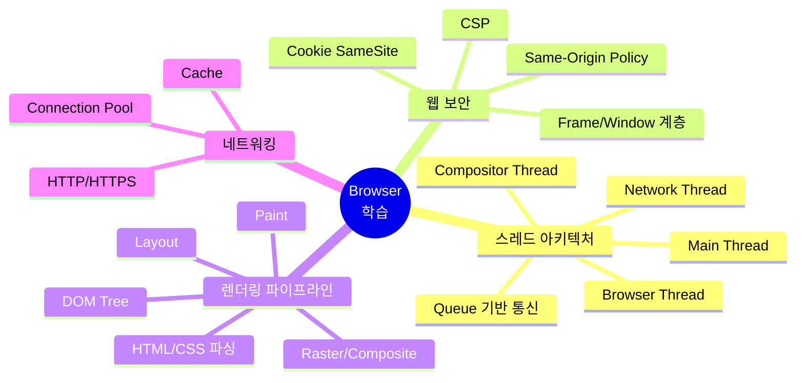

### 주요 학습 내용

| 분야 | 학습 내용 | 관련 파일 |
|------|----------|-----------|
| **스레드** | Chrome 스타일 멀티스레드 아키텍처, Queue 기반 IPC | `threads/`, `core/browser.py` |
| **보안** | SOP, CSP, iframe 보안, Cookie 정책 | `networking/security/`, `scripting/js_context.py` |
| **렌더링** | DOM → Style → Layout → Paint → Composite | `layout/`, `rendering/`, `css/` |
| **JS 엔진** | DOM 바인딩, 이벤트, XHR, setTimeout | `scripting/`, `runtime.js` |

## 실행 방법

```bash
python main.py <URL>
python main.py https://example.com
python server.py  # 테스트 서버
```

---

# Part 1: 전체 구조

## 시스템 아키텍처 개요

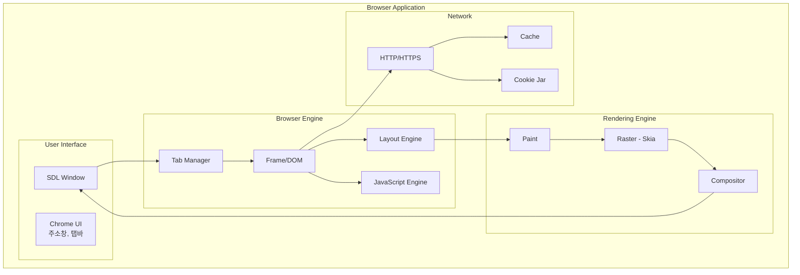

## 데이터 흐름 요약

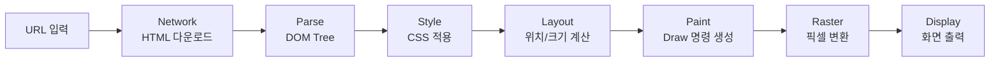

## 클래스 다이어그램 (Core)

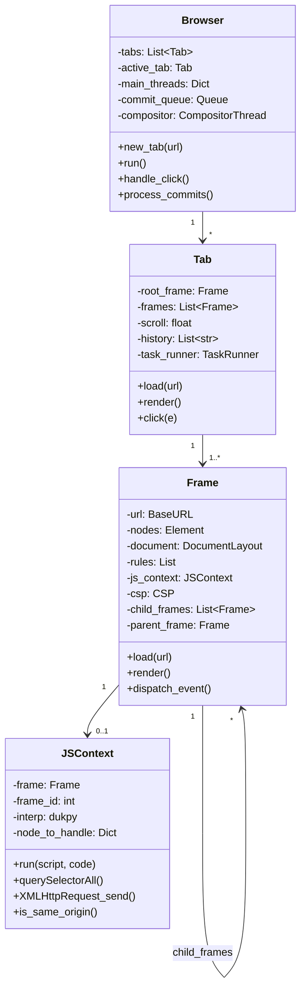

## 페이지 로드 전체 시퀀스

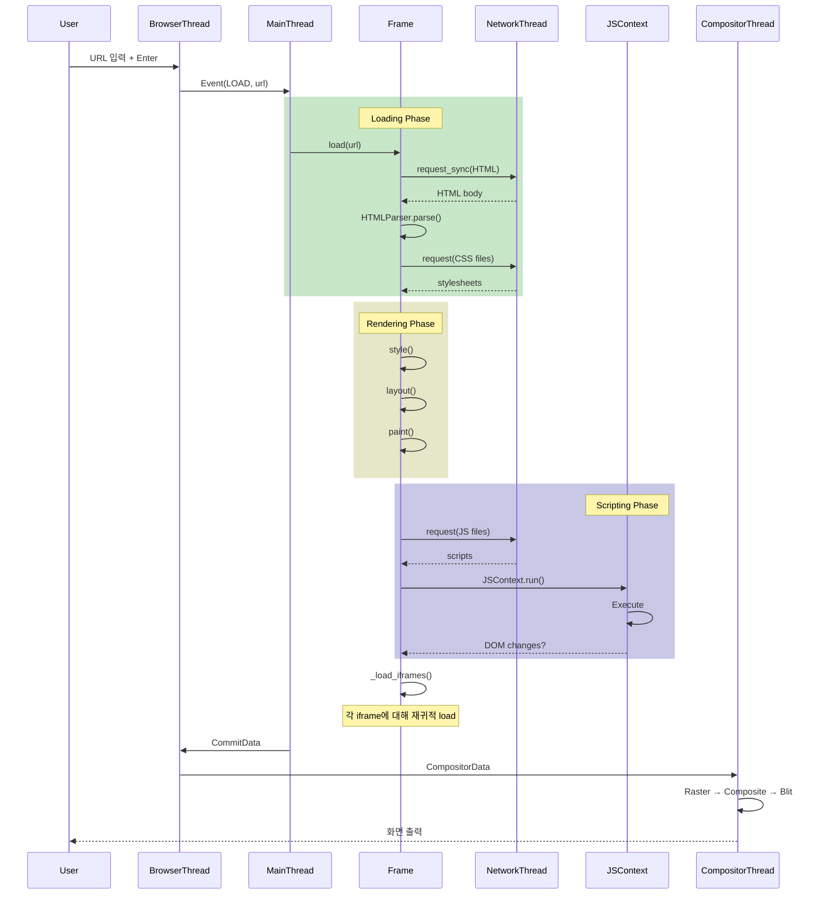

## 프로젝트 구조

```
browser_engine/
├── core/           # Browser 메인 루프
├── content/        # Tab, Frame (문서 관리)
├── threads/        # MainThread, CompositorThread
├── networking/     # NetworkThread, URL 프로토콜
│   ├── protocols/  # HTTP, HTTPS, File, AboutBlank
│   └── security/   # CSP, Cookie
├── scripting/      # JSContext (dukpy)
├── layout/         # DocumentLayout, BlockLayout...
├── rendering/      # DrawText, DrawRect...
├── css/            # CSS 파싱, 스타일 적용
├── dom/            # Element, Text, HTMLParser
└── profiling/      # 성능 측정 (trace.json)
```

---

# Part 2: 스레드 아키텍처

## 전체 스레드 구조

Chrome과 유사한 멀티스레드 아키텍처를 구현합니다.

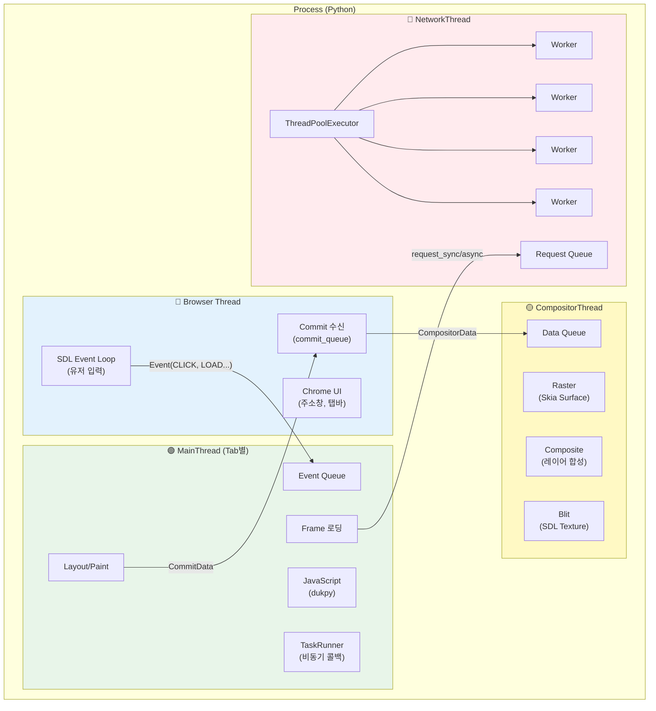

## 왜 스레드를 분리하는가?

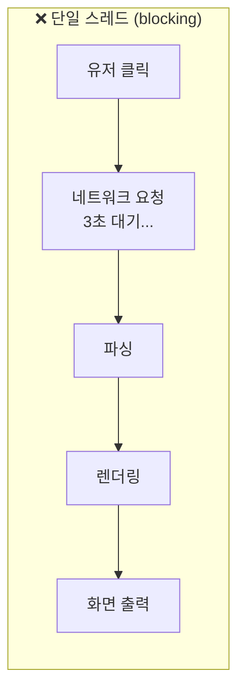

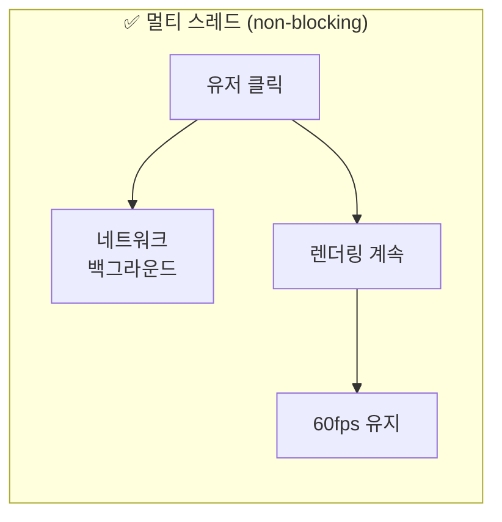

| 스레드 | 역할 | 블로킹 시 문제 |
|--------|------|---------------|
| **Browser Thread** | SDL 이벤트, UI 반응 | 클릭/스크롤 무응답 |
| **MainThread** | DOM, JS, Layout | 페이지 먹통 |
| **CompositorThread** | 픽셀 렌더링 | 화면 멈춤 |
| **NetworkThread** | HTTP 요청 | 모든 로딩 지연 |

## 스레드 간 통신 방식

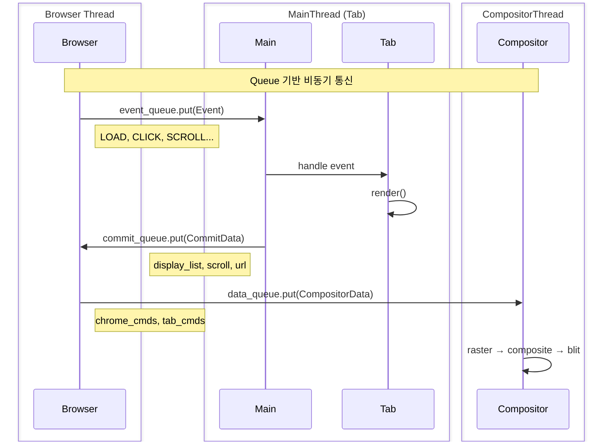

## MainThread 이벤트 루프 상세

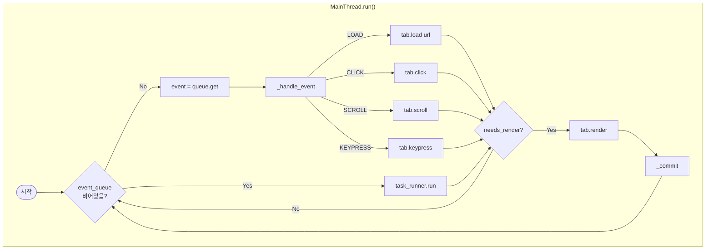

## CommitData & CompositorData 구조

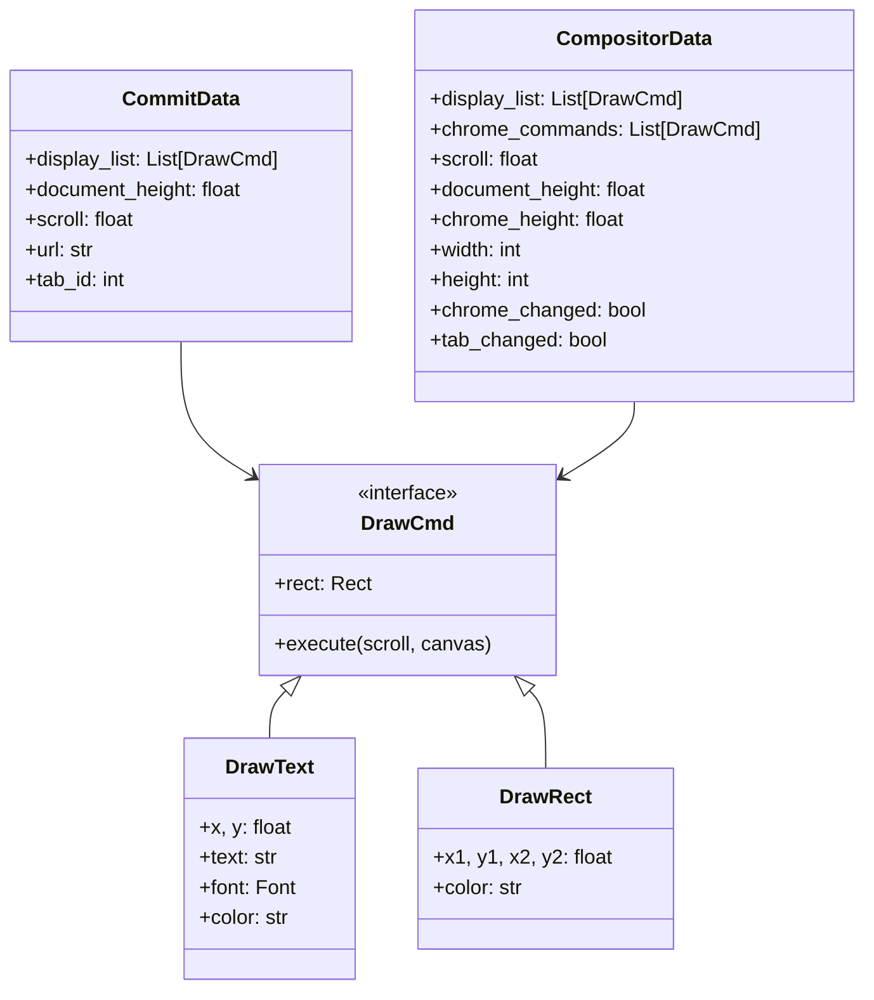

## Compositor 렌더링 파이프라인

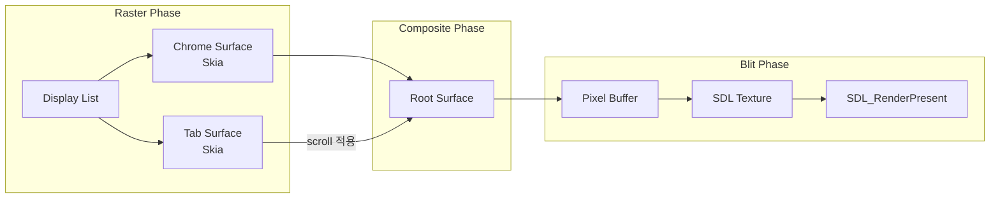

---

# Part 3: 프레임 & 윈도우 보안

## Frame 계층 구조

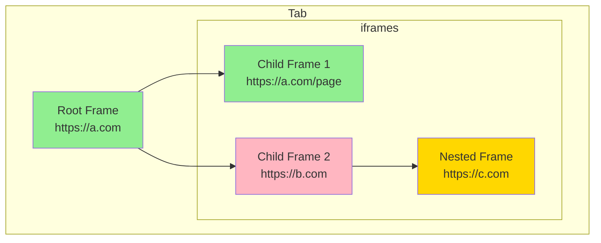

## Window 객체 계층

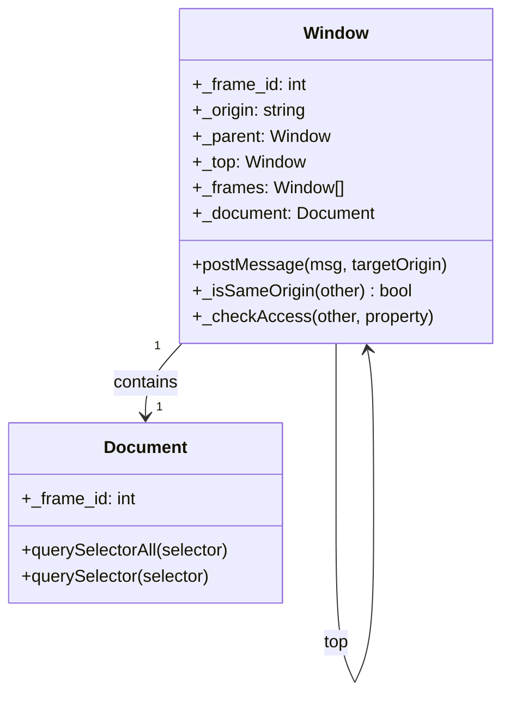

## Same-Origin Policy (SOP)

### Origin이란?

```
https://www.example.com:443/path/page.html
└─┬──┘ └───────┬───────┘└┬┘
scheme       host      port

Origin = scheme + host + port
```

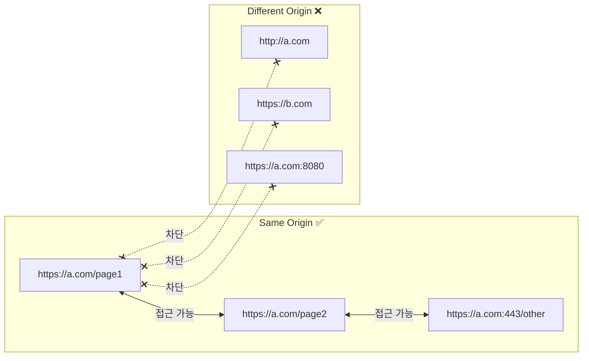

### SOP 적용 범위

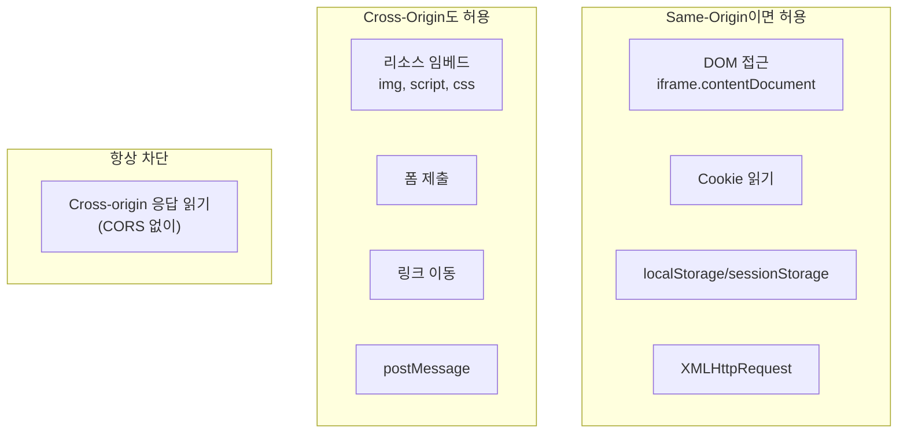

## Cross-Origin 접근 시퀀스

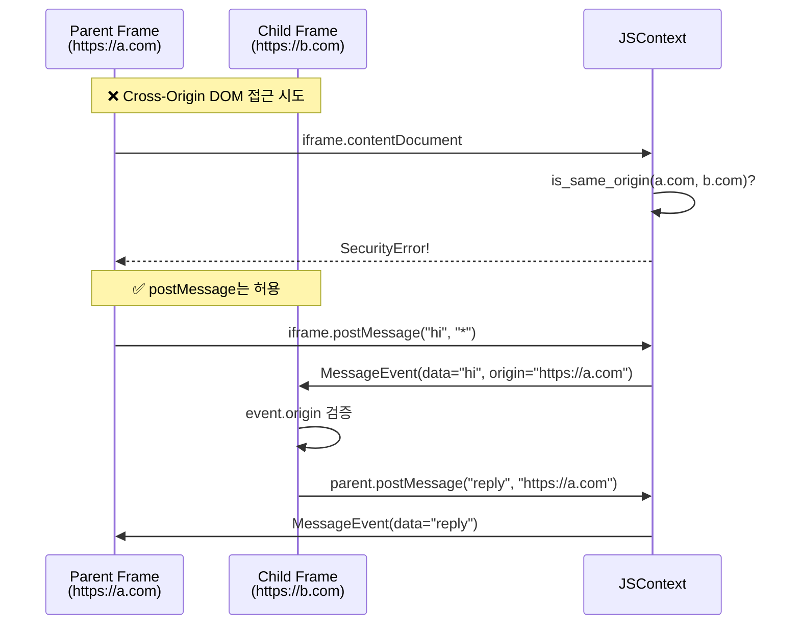

## window.parent / window.top 접근

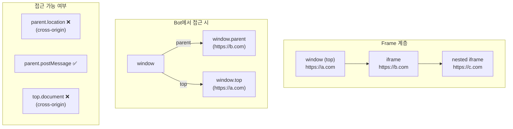

## XHR Same-Origin Policy

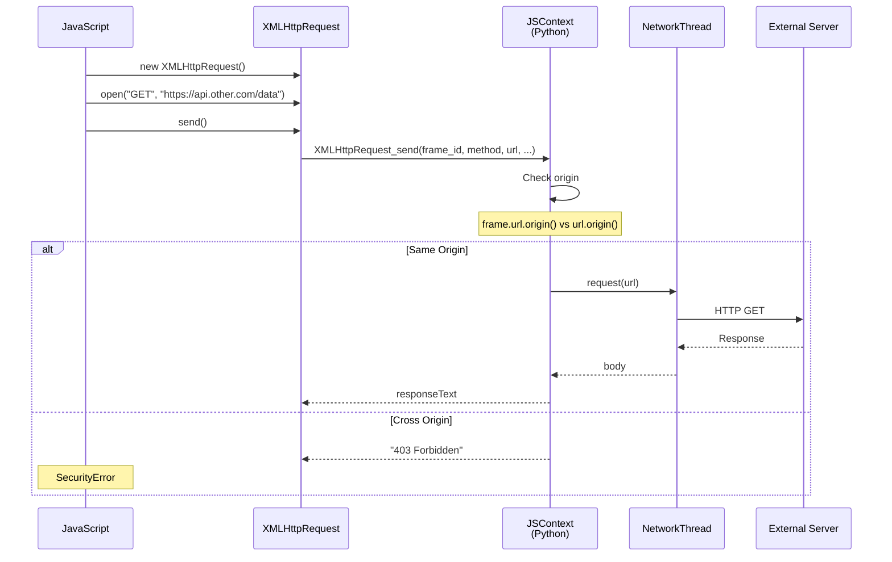

## Content Security Policy (CSP)

### CSP 헤더 파싱

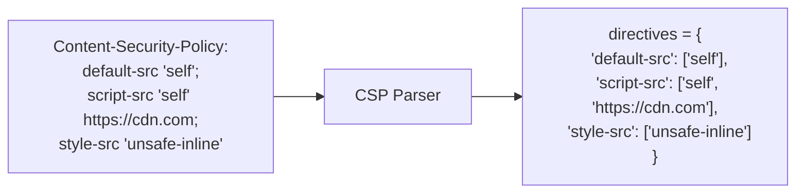

### CSP 검증 흐름

```mermaid
flowchart TB
    subgraph "리소스 로드 시"
        Script["&lt;script src='...'&gt;"]
        Style["&lt;link rel='stylesheet'&gt;"]
        XHR["XMLHttpRequest"]
        IFrame["&lt;iframe src='...'&gt;"]
    end

    Script --> CheckScript{csp.allows_script?}
    Style --> CheckStyle{csp.allows_style?}
    XHR --> CheckConnect{csp.allows_connect?}
    IFrame --> CheckFrame{csp.allows_frame?}

    CheckScript -->|Yes| LoadScript[로드]
    CheckScript -->|No| BlockScript[차단 + 로그]

    CheckStyle -->|Yes| LoadStyle[로드]
    CheckStyle -->|No| BlockStyle[차단]

    CheckConnect -->|Yes| Send[요청]
    CheckConnect -->|No| BlockXHR[차단]

    CheckFrame -->|Yes| LoadFrame[프레임 생성]
    CheckFrame -->|No| BlockFrame[차단]
```

### CSP Directive 우선순위

```mermaid
flowchart TB
    Check["allows_source('script-src', url)"]

    Check --> HasDirective{script-src<br/>정의됨?}
    HasDirective -->|Yes| UseScript[script-src 값 사용]
    HasDirective -->|No| HasDefault{default-src<br/>정의됨?}
    HasDefault -->|Yes| UseDefault[default-src 값 사용]
    HasDefault -->|No| Allow[허용]

    UseScript --> Match{패턴 매칭}
    UseDefault --> Match

    Match -->|매치| Allow[✅ 허용]
    Match -->|불일치| Block[❌ 차단]
```

## Cookie 보안 (SameSite)

```mermaid
flowchart TB
    subgraph "SameSite=Strict"
        S1["Cross-site 요청 시<br/>쿠키 전송 ❌"]
        S2["링크 클릭해서 이동해도 ❌"]
    end

    subgraph "SameSite=Lax (기본값)"
        L1["Cross-site POST ❌"]
        L2["Cross-site GET (top-level) ✅"]
        L3["iframe/img 요청 ❌"]
    end

    subgraph "SameSite=None"
        N1["Cross-site 모두 허용"]
        N2["Secure 필수"]
    end
```